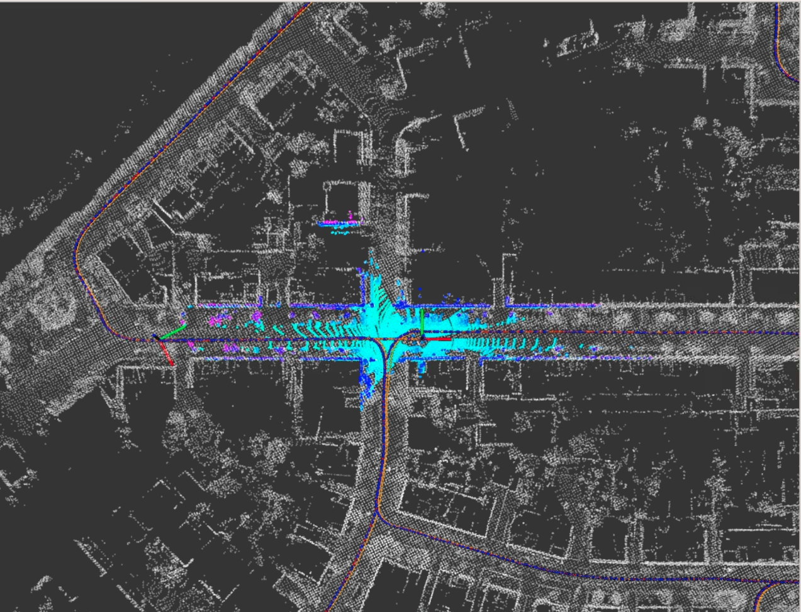

## 补全代码，且滤波功能正常

[todo1](https://github.com/bulinx/bulinx-07-filtering-basic/blob/791445329033e1d3485cab4d59fe962709a5352d/src/lidar_localization/src/models/kalman_filter/error_state_kalman_filter.cpp#L560)

[todo2](https://github.com/bulinx/bulinx-07-filtering-basic/blob/791445329033e1d3485cab4d59fe962709a5352d/src/lidar_localization/src/models/kalman_filter/error_state_kalman_filter.cpp#L605)

[todo3](https://github.com/bulinx/bulinx-07-filtering-basic/blob/e3cc7fc133b2d3105e4616a0a5d1ef07aed10c06/src/lidar_localization/src/models/kalman_filter/error_state_kalman_filter.cpp#L640)

[todo4](https://github.com/bulinx/bulinx-07-filtering-basic/blob/791445329033e1d3485cab4d59fe962709a5352d/src/lidar_localization/src/models/kalman_filter/error_state_kalman_filter.cpp#L691)

[todo5](https://github.com/bulinx/bulinx-07-filtering-basic/blob/791445329033e1d3485cab4d59fe962709a5352d/src/lidar_localization/src/models/kalman_filter/error_state_kalman_filter.cpp#L708)

效果如下：

## 补全代码，功能正常，且经过调试参数，滤波后性能比滤波前好 (请将详细的误差对比结果提供在作业中，供助教有足够依据评阅)
初始参数evo评测结果如下：

 
 

分别增大和减小先验噪声P

 
 

 
 

增大过程噪声Q，减小测量噪声R

 
 

减小过程噪声Q，增大测量噪声R

 
 

分析发现：  
P 是误差协方差初始值，表示对当前预测状态的信任程度    
Q越大越信任观测值  ，融合结果和激光更接近  
R越大越信任预测值

调出的一组较优参数如下：

 
 

融合后evo评测ape的结果中 max、mean、median、min都是融合后更优，其他参数也更为接近

## 在前面的模型推导中, 考虑了器件误差中的随机游走, 请给出不考虑随机游走模型时的推导过程，并在工程框架中实现。对比这两种方法的性能差异(最好给出原因分析)。另外，kalman滤波的性能对噪声的设置较为敏感，请在提供结果的同时，给出不同噪声设置情况下的结果对比(至少5组参数)

主要是B矩阵形式不同

 
 

设置了与2中相同的6组参数：

 
 

 
 

 
 

 
 

 
 

 
 

