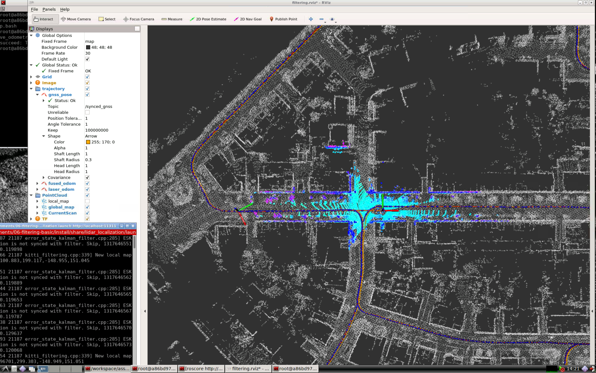

## 补全代码，且滤波功能正常

[todo1](https://github.com/bulinx/bulinx-07-filtering-basic/blob/791445329033e1d3485cab4d59fe962709a5352d/src/lidar_localization/src/models/kalman_filter/error_state_kalman_filter.cpp#L560)

[todo2](https://github.com/bulinx/bulinx-07-filtering-basic/blob/791445329033e1d3485cab4d59fe962709a5352d/src/lidar_localization/src/models/kalman_filter/error_state_kalman_filter.cpp#L605)

[todo3](https://github.com/bulinx/bulinx-07-filtering-basic/blob/791445329033e1d3485cab4d59fe962709a5352d/src/lidar_localization/src/models/kalman_filter/error_state_kalman_filter.cpp#L691)

[todo4](https://github.com/bulinx/bulinx-07-filtering-basic/blob/791445329033e1d3485cab4d59fe962709a5352d/src/lidar_localization/src/models/kalman_filter/error_state_kalman_filter.cpp#L708)

效果如下：



## 良好要求: 补全代码，功能正常，且经过调试参数，滤波后性能比滤波前好 (请将详细的误差对比结果提供在作业中，供助教有足够依据评阅)


为了获取可用于**evo评估**的轨迹输出, 可通过如下`ROS Service Call`, 比较融合前后的Odometry: 

```bash
# set up session:
source install/setup.bash
# save odometry:
rosservice call /save_odometry "{}"
# run evo evaluation:
# a. laser:
evo_ape kitti ground_truth.txt laser.txt -r full --plot --plot_mode xy
# b. fused:
evo_ape kitti ground_truth.txt fused.txt -r full --plot --plot_mode xy
```

### 优秀要求: 在前面的模型推导中, 考虑了器件误差中的随机游走, 请给出不考虑随机游走模型时的推导过程，并在工程框架中实现。对比这两种方法的性能差异(最好给出原因分析)。另外，kalman滤波的性能对噪声的设置较为敏感，请在提供结果的同时，给出不同噪声设置情况下的结果对比(至少5组参数)

此处留白, 把舞台全部交给勇敢挑战优秀的你. 期待你的精彩发挥!
